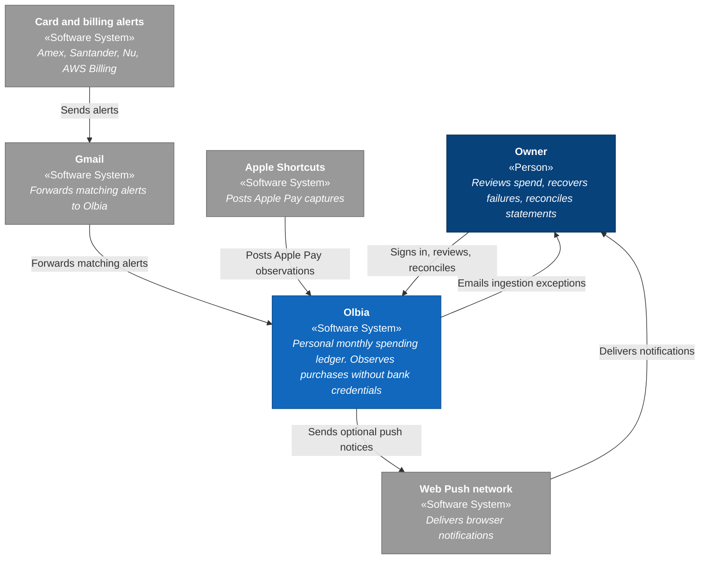

# Olbia

A personal monthly spending ledger. It observes real purchases from bank email alerts and Apple Pay, keeps source evidence for every signal, and answers clearly how much has been spent, what pace the month is on, and what remains after upcoming commitments.

It never asks for bank credentials. It works from notifications already arriving by email and from authenticated observations on the phone.

## Design idea

The primary unit is not a final accounting transaction — it is an **observed event**.

- Every alert or automation leaves an immutable observation with its source.
- Multiple observations of the same purchase can be reconciled; none are deleted.
- Ambiguous cases stay for human review. A purchase is never invented by inference.
- Original MIME, Apple Pay payloads, fallback CSVs, statement PDFs, and Textract extractions are retained encrypted before mapping.
- MSI schedules attach to the observed purchase: committed cuotas reduce remaining money until statement/CSV evidence marks them spent.

That separates capture, evidence, reconciliation, and presentation — production-grade financial system discipline, applied to a single-user product.

## Architecture

System context ([C4](https://c4model.com/) level 1). Container and component diagrams live in [docs/architecture.md](docs/architecture.md).



| Colour | Meaning |
| --- | --- |
| Dark blue | «Person» |
| Mid blue | «Software System» in scope |
| Grey | External «Software System» |

Everything runs on AWS (`us-east-2`), defined with CDK in TypeScript. Deploys from `main` via GitHub Actions with OIDC — no AWS keys stored in the repository.

| Layer | Responsibility |
| --- | --- |
| Ingestion | Deduplicate, extract via Textract, persist metadata, and link evidence |
| Domain | Shared types, minor-unit money, cross-service rules |
| API | Ledger, monthly plan, CSV reconciliation, Apple Pay observations |
| Web | Mobile-first summary and movements with evidence |
| Infrastructure | SES, S3, SQS, Lambda, DynamoDB, Cognito, CloudFront |

## Monorepo

```text
apps/web              Review UI (React + Vite)
services/api          HTTP handlers for the ledger
services/ingestion    Email pipeline and bank parsers
packages/domain       Shared contract across services
infrastructure        CDK: product stack + CI bootstrap
docs                  Product, UI, and operational decisions
tests/fixtures/email  Anonymized .eml fixtures — never real mail
```

npm workspaces, strict TypeScript, and Vitest. Parsers are tested against real American Express and Santander México formats.

## Decisions that matter

- **Traceability over convenience** — the full source is retained; parsing is reviewable and never rewrites the original.
- **Idempotency per source** — forwards and retries do not duplicate the ledger.
- **Explicit reconciliation** — a unique high-confidence match links; ambiguity requires a decision.
- **Closed auth** — Cognito with a single user; no public signup.
- **Linear history on `main`** — PRs with a quality gate (tests, types, build, `cdk synth`) and automatic deploy.

## Documentation

- [Architecture (C4)](docs/architecture.md) — containers and components
- [V1 decisions](docs/v1-decisions.md) — scope, data model, and infrastructure
- [Meses sin intereses (MSI)](docs/msi.md) — plans, imports, UI, and month math
- [UI direction](docs/ui-design-brief.md) — hierarchy, personality, and mobile navigation
- [Gmail → SES forwarding](docs/gmail-forwarding.md)
- [Apple Pay Shortcut](docs/apple-pay-shortcut.md)
- [iOS home-screen web app](docs/ios-home-screen-web-app.md)

Personal project in production. The code is public as a sample of how I structure an end-to-end system.
