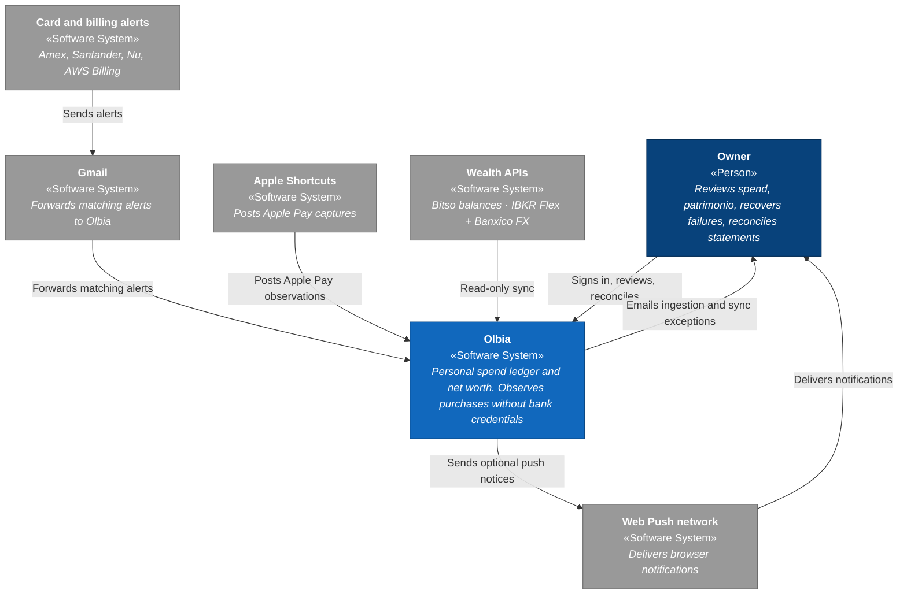

# Olbia

A personal monthly spending ledger **and** net-worth view. It observes real purchases from bank email alerts and Apple Pay, tracks patrimonio (assets − card balances), keeps source evidence for every signal, and answers clearly how much has been spent, what remains after commitments, and what you are worth today.

It never asks for bank credentials. It works from notifications already arriving by email, authenticated observations on the phone, statement PDFs, CFDI nómina XMLs, and read-only wealth APIs.

## Design idea

The primary unit is not a final accounting transaction — it is an **observed event**.

- Every alert or automation leaves an immutable observation with its source.
- Multiple observations of the same purchase can be reconciled; none are deleted.
- Ambiguous cases stay for human review. A purchase is never invented by inference.
- Original MIME, Apple Pay payloads, fallback CSVs, statement Textract JSON, and Amex/Santander PDFs are retained encrypted before parsing.
- MSI schedules attach to the observed purchase: committed cuotas reduce remaining money until statement/CSV evidence marks them spent.
- Month income comes from uploaded CFDI nómina XMLs (not a typed total). Patrimonio snapshots live beside the spend ledger on the same DynamoDB table.

That separates capture, evidence, reconciliation, and presentation — production-grade financial system discipline, applied to a single-user product.

## Architecture

System context ([C4](https://c4model.com/) level 1). Container and component diagrams live in [docs/architecture.md](docs/architecture.md).



| Colour | Meaning |
| --- | --- |
| Dark blue | «Person» |
| Mid blue | «Software System» in scope |
| Grey | External «Software System» |

Everything runs on AWS (`us-east-2`), defined with CDK in TypeScript. Deploys from `main` via GitHub Actions with OIDC — no AWS keys stored in the repository. Node.js **24** in CI and Lambdas.

| Layer | Responsibility |
| --- | --- |
| Web | Resumen, Movimientos, Patrimonio (`apps/web`) |
| Domain | Shared types, MSI, month summary, wealth, payroll, card cycle (`packages/domain`) |
| API | Ledger HTTP, statements, nómina, wealth sync, Apple Pay, scheduled pushes (`services/api`) |
| Ingestion | Email parsers and SES worker (`services/ingestion`) |
| Ledger | Observed-event persistence and month-index helpers (`services/ledger`) |
| Notify | Web Push subscriptions and delivery (`services/notify`) |
| Infrastructure | CDK + thin Lambda adapters only (`infrastructure`) |

## Monorepo

```text
apps/web              Review UI (React + Vite)
services/api          Ledger API, imports, wealth, Apple Pay, card/daily push jobs
services/ingestion    Email parsers + SES ingestion worker
services/ledger       Observed-event persistence and month-index helpers
services/notify       Web Push subscriptions and send helpers
packages/domain       Shared contract across services
infrastructure        CDK stacks + thin Lambda entrypoints (re-export services)
docs                  Product, UI, and operational decisions
tests/fixtures/email  Anonymized .eml fixtures — never real mail
```

npm workspaces, strict TypeScript, and Vitest. Parsers are tested against real American Express and Santander México formats.

## Decisions that matter

- **Traceability over convenience** — the full source is retained; parsing is reviewable and never rewrites the original.
- **Idempotency per source** — forwards and retries do not duplicate the ledger.
- **Explicit reconciliation** — a unique high-confidence match links; ambiguity requires a decision.
- **Closed auth** — Cognito with a single user; no public signup. Sign-in is personalized for that owner.
- **Linear history on `main`** — PRs with a quality gate (tests, types, build, `cdk synth`) and automatic deploy.

## Documentation

- [Architecture (C4)](docs/architecture.md) — containers and components
- [V1 decisions](docs/v1-decisions.md) — scope, data model, and infrastructure
- [Patrimonio](docs/patrimonio.md) — net worth accounts, liabilities, and sync
- [Meses sin intereses (MSI)](docs/msi.md) — plans, imports, UI, and month math
- [Cobros manuales](docs/manual-observed-charges.md) — observed charges without automation
- [UI direction](docs/ui-design-brief.md) — hierarchy, personality, and mobile navigation
- [Gmail → SES forwarding](docs/gmail-forwarding.md)
- [Apple Pay Shortcut](docs/apple-pay-shortcut.md)
- [iOS home-screen web app](docs/ios-home-screen-web-app.md)
- [Push on new observable](docs/push-on-new-observable.md) · [Daily balance](docs/daily-balance-push.md) · [Card cycle](docs/card-cycle-push.md)

Personal project in production. The code is public as a sample of how I structure an end-to-end system.
