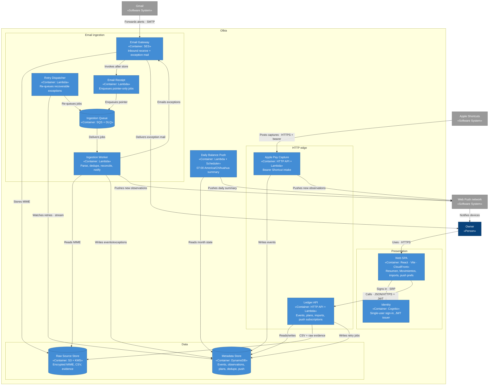
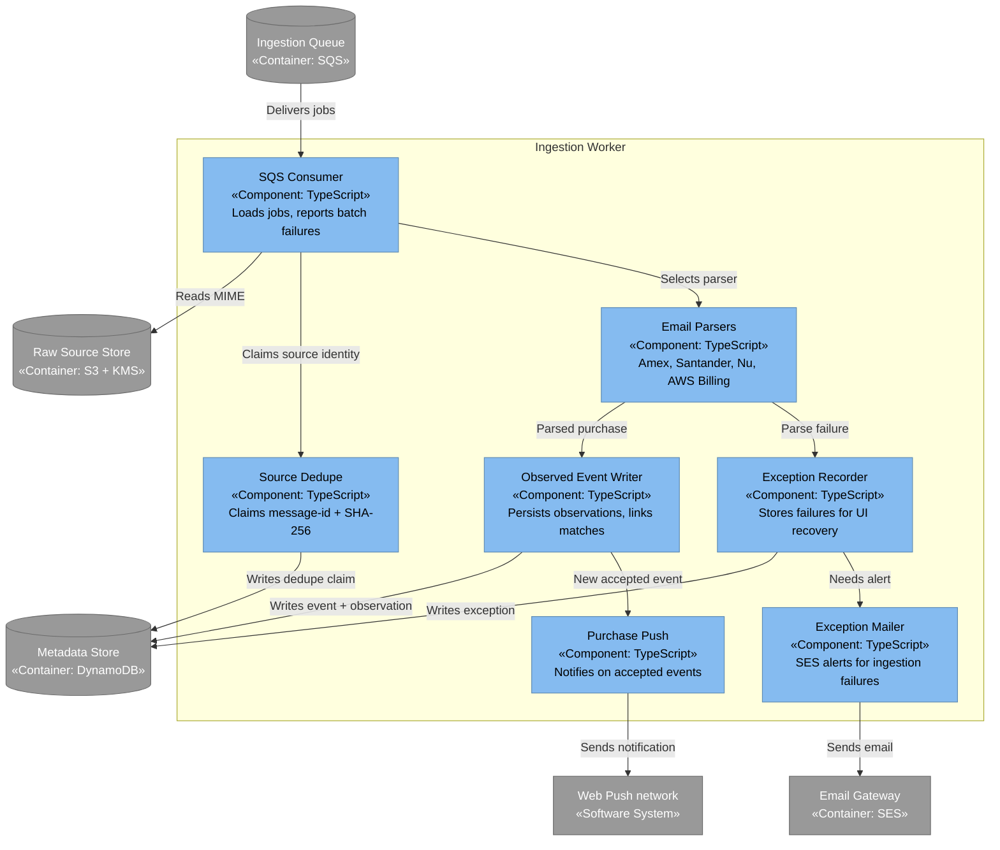
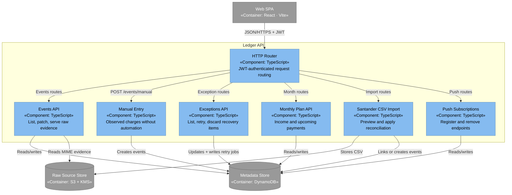
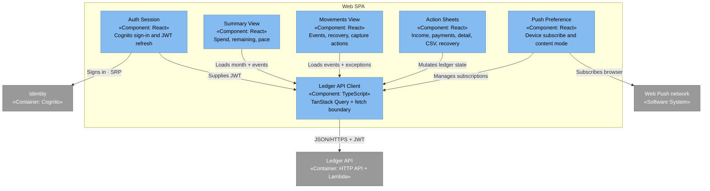

# Architecture (C4)

Maps of Olbia at three levels of zoom, following the [C4 model](https://c4model.com/). Mermaid flowcharts use C4 colours and stereotypes so they render cleanly on GitHub.

| Colour | Meaning |
| --- | --- |
| Dark blue | «Person» |
| Mid blue | «Software System» in scope |
| Light blue | «Container» or «Component» |
| Grey | External «Person», system, or «Container» |

Start with the [system context diagram in the root README](../README.md#architecture), then zoom into containers and components below.

## Container diagram (C2)

**Scope:** Olbia. **Audience:** engineers and operators.

Shows how responsibilities split across the SPA, HTTP edge, email ingestion pipeline, scheduled push, and data stores. Production entry points live under `infrastructure/lambda/`; `services/*` are portable libraries used mainly for tests.

## Component diagram — Ingestion Worker (C3)

**Scope:** Ingestion Worker container. **Audience:** developers changing parsers or reconciliation.

## Component diagram — Ledger API (C3)

**Scope:** Ledger API container. **Audience:** developers changing HTTP routes or ledger mutations.

Exception retries write a DynamoDB retry job; the Retry Dispatcher (C2) watches the stream and re-queues SQS — the API does not send to SQS directly.

## Component diagram — Web SPA (C3)

**Scope:** Web SPA container. **Audience:** developers changing the review UI.

## Related docs

- [V1 decisions](v1-decisions.md) — binding scope, data model, and AWS choices
- [Gmail → SES forwarding](gmail-forwarding.md)
- [Apple Pay Shortcut](apple-pay-shortcut.md)
- [Push on new observable](push-on-new-observable.md)
- [Daily balance push](daily-balance-push.md)
