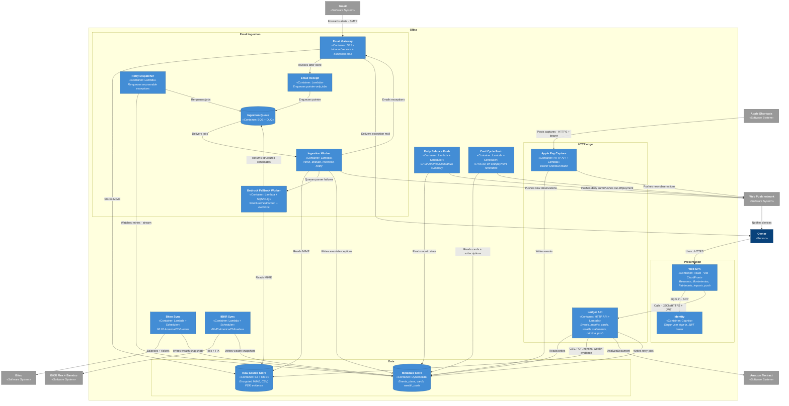
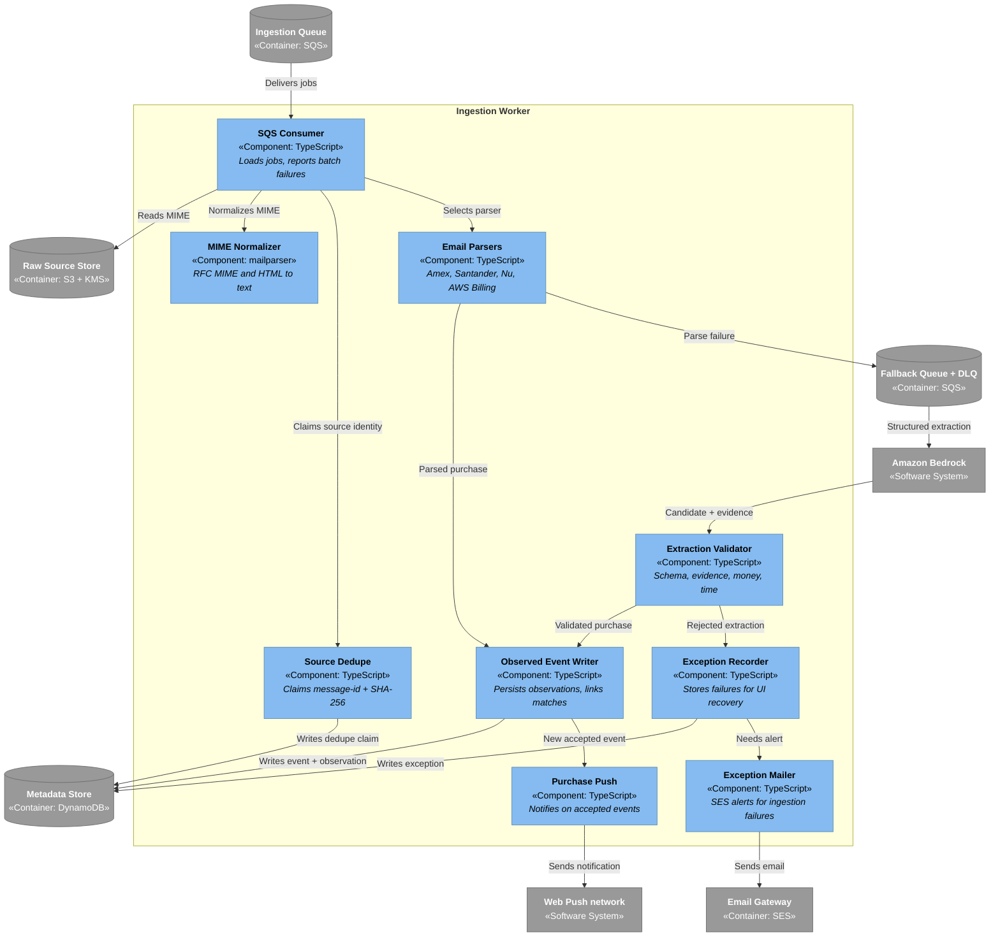
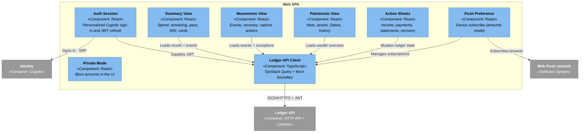

# Architecture (C4)

Maps of Olbia at three levels of zoom, following the [C4 model](https://c4model.com/). Mermaid flowcharts use C4 colours and stereotypes so they render cleanly on GitHub.

| Colour | Meaning |
| --- | --- |
| Dark blue | «Person» |
| Mid blue | «Software System» in scope |
| Light blue | «Container» or «Component» |
| Grey | External «Person», system, or «Container» |

Start with the [system context diagram in the root README](../README.md#architecture), then zoom into containers and components below.

## Container diagram (C2)

**Scope:** Olbia. **Audience:** engineers and operators.

Shows how responsibilities split across the SPA, HTTP edge, email ingestion pipeline, scheduled push and wealth sync, and data stores. Application logic lives in `services/*` and `packages/domain`. Shared observed-event persistence and month indexing live in `services/ledger`. `infrastructure/lambda/` holds thin adapters that re-export service handlers (plus a few infra-only functions: SES receipt, retry dispatcher, VAPID custom resource).

## Component diagram — Ingestion Worker (C3)

**Scope:** Ingestion Worker container. **Audience:** developers changing parsers or reconciliation.

## Component diagram — Ledger API (C3)

**Scope:** Ledger API container. **Audience:** developers changing HTTP routes or ledger mutations.

Exception retries write a DynamoDB retry job; the Retry Dispatcher (C2) watches the stream and re-queues SQS — the API does not send to SQS directly.

Month income on `GET /months/:month` is derived from CFDI nómina payslips. `PUT /months/:month` persists only `upcomingPayments`.

```mermaid
flowchart TB
  classDef component fill:#85BBF0,stroke:#5D8AB3,color:#000,stroke-width:1px
  classDef external fill:#999999,stroke:#6B6B6B,color:#fff,stroke-width:1px

  spa["`**Web SPA**
«Container: React · Vite»`"]
  ddb[("`**Metadata Store**
«Container: DynamoDB»`")]
  raw[("`**Raw Source Store**
«Container: S3 + KMS»`")]
  textract["`**Amazon Textract**
«Software System»`"]

  subgraph api["`**Ledger API**`"]
    direction TB
    router["`**HTTP Router**
«Component: TypeScript»
_JWT-authenticated request routing_`"]
    events["`**Events API**
«Component: TypeScript»
_List, patch, serve raw evidence_`"]
    manual["`**Manual Entry**
«Component: TypeScript»
_Observed charges without automation_`"]
    exceptions["`**Exceptions API**
«Component: TypeScript»
_List, retry, discard recovery items_`"]
    months["`**Monthly Plan API**
«Component: TypeScript»
_Upcoming payments; income via nómina GET_`"]
    cards["`**Cards API**
«Component: TypeScript»
_Cut-off and payment day profiles_`"]
    wealth["`**Wealth API**
«Component: TypeScript»
_Overview, Cajita, liabilities, sync_`"]
    statements["`**Statement Imports**
«Component: TypeScript»
_Amex + Santander PDF via Textract_`"]
    csv["`**Santander CSV Import**
«Component: TypeScript»
_Preview and apply reconciliation_`"]
    nomina["`**CFDI Nómina**
«Component: TypeScript»
_XML upload and payslip queries_`"]
    pushsubs["`**Push Subscriptions**
«Component: TypeScript»
_Register and remove endpoints_`"]
  end

  spa -->|"JSON/HTTPS + JWT"| router
  router -->|"Events routes"| events
  router -->|"POST /events/manual"| manual
  router -->|"Exception routes"| exceptions
  router -->|"Month routes"| months
  router -->|"Card routes"| cards
  router -->|"Wealth routes"| wealth
  router -->|"Statement preview/poll/apply"| statements
  router -->|"CSV import routes"| csv
  router -->|"POST /imports/nomina"| nomina
  router -->|"Push routes"| pushsubs

  events -->|"Reads/writes"| ddb
  events -->|"Reads MIME evidence"| raw
  manual -->|"Creates events"| ddb
  exceptions -->|"Updates + writes retry jobs"| ddb
  months -->|"Reads/writes"| ddb
  cards -->|"Reads/writes"| ddb
  wealth -->|"Reads/writes"| ddb
  wealth -->|"Stores sync evidence"| raw
  statements -->|"Stores PDF + textract JSON"| raw
  statements -->|"AnalyzeDocument"| textract
  statements -->|"Links or creates events"| ddb
  csv -->|"Stores CSV"| raw
  csv -->|"Links or creates events"| ddb
  nomina -->|"Stores XML + payslips"| ddb
  nomina -->|"Stores XML evidence"| raw
  pushsubs -->|"Reads/writes"| ddb

  class router,events,manual,exceptions,months,cards,wealth,statements,csv,nomina,pushsubs component
  class spa,ddb,raw,textract external
```

## Component diagram — Web SPA (C3)

**Scope:** Web SPA container. **Audience:** developers changing the review UI.

## Related docs

- [V1 decisions](v1-decisions.md) — binding scope, data model, and AWS choices
- [Patrimonio](patrimonio.md)
- [Meses sin intereses (MSI)](msi.md)
- [UI design brief](ui-design-brief.md)
- [Gmail → SES forwarding](gmail-forwarding.md)
- [Apple Pay Shortcut](apple-pay-shortcut.md)
- [Push on new observable](push-on-new-observable.md)
- [Daily balance push](daily-balance-push.md)
- [Card cycle push](card-cycle-push.md)
