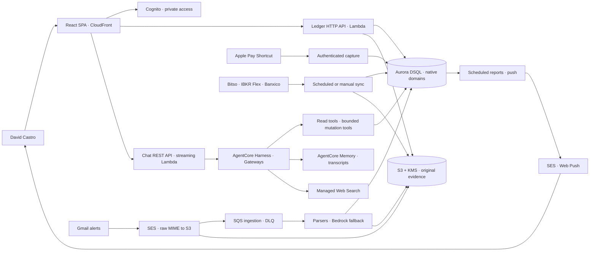

# Architecture

Olbia serves David alone under the binding [product north star](product-north-star.md). **Aurora DSQL is the sole product persistence authority.** All active domains use domain keys, typed columns, native constraints, direct SQL and transactional operations. Financial contracts live in [financial rules](financial-rules.md); release/recovery steps in [operations](operations.md).

## System map

```mermaid
flowchart LR
  David[David Castro] --> Web[React SPA · CloudFront]
  Web --> Cognito[Cognito · private access]
  Web --> API[Ledger HTTP API · Lambda]
  Web --> Chat[Chat REST API · streaming Lambda]
  Gmail[Gmail alerts] --> SES[SES · raw MIME to S3]
  SES --> SQS[SQS ingestion · DLQ]
  SQS --> Ingest[Parsers · Bedrock fallback]
  Shortcut[Apple Pay Shortcut] --> Capture[Authenticated capture]
  Providers[Bitso · IBKR Flex · Banxico] --> Sync[Scheduled or manual sync]
  Ingest --> SQL[(Aurora DSQL · native domains)]
  Capture --> SQL
  Sync --> SQL
  API --> SQL
  API --> Evidence[(S3 + KMS · original evidence)]
  SES --> Evidence
  Sync --> Evidence
  Ingest --> Evidence
  Chat --> Harness[AgentCore Harness · Gateways]
  Harness --> Tools[Read tools · bounded mutation tools]
  Tools --> SQL
  Harness --> Memory[AgentCore Memory · transcripts]
  Harness --> Search[Managed Web Search]
  SQL --> Jobs[Scheduled reports · push]
  Jobs --> Delivery[SES · Web Push]
  Delivery --> David
```

Financial services, evidence and financial Gateway run in `us-east-2`. AgentCore Harness/Memory and managed Web Search run in `us-east-1`. Cognito protects David's private access; there is no public signup. Ledger uses API Gateway HTTP API; chat uses a dedicated REST API with native response streaming. The browser never calls AgentCore directly.

Statement PDFs upload directly from the browser to the existing KMS-encrypted S3 evidence bucket through a ten-minute signed conditional PUT, bound to authenticated owner/provider/content hash, SHA-256 checksum, exact file size and PDF content type (maximum 50 MiB). Preview receives metadata only and verifies the retained original before Textract; retry never replaces evidence. The API rejects binary statement uploads.

SES stores encrypted MIME before pointer-only SQS intake. Known deterministic parsers are the fast path; an isolated Bedrock fallback queue returns schema-constrained candidates only accepted after deterministic institution/type/money/status/time and literal-evidence validation. Retries preserve source identity; failed extraction does not permanently consume a financial claim. Lambdas have no reserved concurrency; public API throttling protects the account's shared concurrency.

## Where changes belong

| Directory | Responsibility |
| --- | --- |
| [`apps/web`](../apps/web) | React/Vite UI and HTTP client. |
| [`packages/domain/src`](../packages/domain/src) | Shared contracts and deterministic spend, MSI, payroll, wealth, card and notification calculations. |
| [`services/api/src`](../services/api/src) | HTTP routes, imports, planning, wealth sync, reports and assistant adapters. |
| [`services/ingestion`](../services/ingestion) | MIME normalization, institution parsers, fallback validation and email intake. |
| [`services/ledger/src/dsql`](../services/ledger/src/dsql) | Native SQL domains, readers/writers, relationships, constraints and bootstrap. |
| [`services/notify`](../services/notify) | Web Push transport and subscription consumers. |
| [`infrastructure`](../infrastructure) | CDK and thin Lambda adapters, plus infrastructure-only receipt/retry/provisioning functions. |

The [versioned bootstrap](../services/ledger/src/dsql/schema.ts) and adjacent `*-schema.ts` modules are the exact DDL/constraint/permission authority. Start with [ledger schema](../services/ledger/src/dsql/ledger-schema.ts) or [wealth schema](../services/ledger/src/dsql/wealth-schema.ts) for those domains. Do not maintain a parallel handwritten column/catalog snapshot.

## Relational ownership

- Ledger owns current movements, ordered observations/warnings/tags, immutable revisions, bulk operations/members, installments and source claims. Primary observation ownership is a real deferred relationship. `movement_months` derives current movement and installment membership; it is not a stored feed projection.
- Classification, card profiles, monthly plan parents/ordered payments and CFDI receipts/ordered SAT lines have their own native identities. Catalog reads never reseed defaults and application roles cannot delete catalog rows. An empty month parent has financial meaning.
- Bank imports use provider kind/content hash plus ordered rows/candidates. Retained selected/candidate movement IDs are historical assertions, not proof of current relationships. Typed provenance links actual rows where proven and preserves ambiguity otherwise.
- Assets/liabilities own immutable capture headers, holdings, daily selections and replacement relationships. Totals derive from holdings; Fondo remains payroll-derived.
- Push owns native subscription identity/transport keys. Public readers select metadata only; transport readers have the scoped secrets/keys they need.
- Monthly email preparations and provider receipts are separate append-only relations; their relationship determines sent state.
- Conversation metadata and the single personal active selection live in SQL with a real FK. AgentCore owns transcript events, session discovery and provider retention.
- Review exceptions, proven suppression claims and request-time retry attempts are relational. Completion links the exact attempt to a movement in the same financial transaction; absent historical UUIDs remain absent.

JSON preserves original provider metadata, before/after revisions, immutable selection/change assertions, extraction answers and prepared report facts/analysis. It never replaces current domain columns, child relationships or operational authority.

## Transactions and providers

The [shared SQL runtime](../services/ledger/src/dsql/sql-runtime.ts) carries the current transaction/client and application barrier. The official DSQL connector owns snapshots, OCC retry and rollback. Compose domain writes inside that transaction; native uniqueness/constraints enforce identities and relationships. Preserve authenticated owner binding without introducing tenants.

Retryable SQL callbacks must not repeat S3, model, provider or notification IO. Source-kind/token claims protect capture idempotency; original objects use conditional S3 creation. Reserve complete mutation budgets, including children/revisions/claims and import completion. Payroll allows at most 2,998 lines, reserving receipt/barrier rows within the current 3,000-row transaction limit. Over-budget or interrupted operations fail atomically.

Provider acceptance and SQL cannot commit together. SES acceptance before receipt persistence may resend; SQS send precedes conditional dispatch recording. Provider-first conversation deletion can partially complete before metadata deletion. Preserve these explicit failure boundaries; do not claim exactly-once transport or fabricate provider history.

## Recovery boundary and schema changes

The October 4 cleanup is deployed and independently accepted ([#207](https://github.com/DavidCs9/personal-finance-system/pull/207)): 38 native domain tables and three operational controls remain, with schema version 21 recorded. David's explicit 2026-10-04 decision removed all migration copies from DSQL: 24 frozen domain relations plus `projection_state` and `command_receipts`. No archive schema, recreated copy or verifier dependency is allowed. Retained DynamoDB is pre-cutover recovery; native DSQL backups protect current finances and S3 retains originals. Product reads/writes never fall back to DynamoDB. Current controls `schema_migrations`, `runtime_state` and `application_barrier` remain operational, with validated identities/modes and scoped mutable columns; they are not migration copies.

Keep original observations, payroll, wealth captures, revisions and replacement evidence immutable under scoped grants. Do not impose current-catalog FKs on historical before/after assertions or manufacture missing claim parents/card mappings. Normalization acceptance does not certify every historical bank charge or justify deleting evidence.

Bootstrap performs native-only resumable versioned DDL, waits for asynchronous indexes/constraint validation and grants, and never recreates or copies the retired relations. Historical migration fixtures belong only in test helpers. Reviewed catalog retirement uses the [explicit allowlist](../services/ledger/src/dsql/catalog.ts), verifies retained DynamoDB and native catalog/dependencies, and drops only allowed copies with RESTRICT in dependency order after deployed financial/rollback gates pass. No CASCADE or financial-history deletion; incomplete cleanup resumes without a completion marker until native checks pass. Increment provider/migration versions for changes; `CREATE TABLE IF NOT EXISTS` alone does not alter columns. CloudFormation Delete performs no SQL mutation. Authority transitions require staged reader/writer protection and reviewed recovery decisions.
