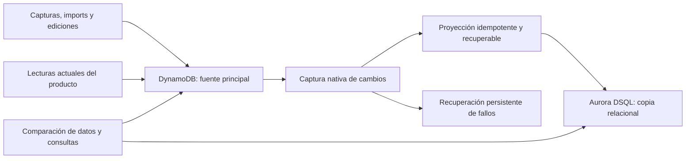

# Migración gradual del ledger a Aurora DSQL

The completed [domain-read phase](dsql-domain-reads.md) enables guarded SQL for read-only categories/rules, standalone cards/cycles and worker/assistant movement consumers after separate verified shadow and promotion PRs. Its consumer inventory supersedes earlier remaining-read lists; all writes, authoritative decisions and strong freshness references remain in DynamoDB. Production evidence and rollback are recorded there.

Estado actualizado: proyección histórica y continua activa y verificada en producción; lecturas SQL de movimientos, planes mensuales, nómina y sus cálculos mensuales/Patrimonio activas en modo guarded-sql, con comparación fuerte de frescura y fallback a DDB. Ver [runbook de implementación](dsql-migration-runbook.md), [esquema desplegado](dsql-schema.md), [lecturas de movimientos](dsql-read-migration.md) y [planes/nómina y evidencia de rollout](dsql-planning-payroll.md). DynamoDB conserva autoridad de escrituras; la fase [Patrimonio](dsql-patrimonio.md) completó la proyección de canónicos/auditoría y activó guarded-sql en producción mediante una segunda PR, tras verificar datos reales en sombra y repetir la verificación independiente al promover. El inventario y las listas iniciales siguientes conservan el contexto del plan original; estos documentos de implementación registran el estado actual.
Fecha: 2026-09-30, America/Chihuahua.
Base investigada: `origin/main`, commit `9eadb571e9f19047d2525ab4effd48db65970d08`.
Rama de entrega del plan: `codex/dsql-migration-plan`.

## Intención del usuario y alcance autorizado

Migrar gradualmente movimientos y sus relaciones a Aurora DSQL para simplificar consultas y mejorar integridad. El usuario quiere empezar octubre con DSQL y solicita preparar este plan para que otra sesión en la nube continúe la implementación. La sesión original entregó únicamente este plan; la continuación autorizó implementar la primera entrega de extremo a extremo y preparar una PR lista para integrar.

Seguir el [norte del producto](product-north-star.md): **Olbia es la aplicación privada de David Castro para llevar el control de su situación financiera general. David Castro es su único usuario y dueño.** La migración simplifica el manejo de sus datos financieros y mejora su confiabilidad, sin introducir otros usuarios o tenants. Trabajar directamente con sus datos reales para investigar, diseñar el esquema y validar la migración; **no se requiere anonimizar, enmascarar ni generar un dataset sintético como paso previo**.

Aplicar una solución proporcional al volumen real: componentes nativos, pocos recursos y verificaciones concretas. La prioridad es poner en marcha la copia en DSQL y comparar con DDB. No agregar soporte multiusuario, abstracciones genéricas, estudios extensos de capacidad ni periodos de espera arbitrarios. El inventario y las pruebas pueden hacerse junto con la primera implementación. Las garantías necesarias son conservar los datos, evitar duplicados o sobrescrituras antiguas, recuperar fallos y poder volver a DDB.

**NO BORRAR DYNAMODB durante la convivencia.** Conservar la tabla, sus datos, sus índices, protección y funcionamiento. Durante la convivencia, las operaciones del dominio deben continuar llegando a ambas bases. Tampoco reemplazar o recrear la tabla existente por un cambio de construct ID o logical ID. David indicó explícitamente el 2026-09-30 que la meta final es retirar DDB; esa decisión cambia el destino del plan, pero no autoriza perder datos ni omitir la migración y verificación previas al retiro.

Objetivo inmediato recomendado: desplegar captura y proyección de cambios a DSQL mientras DynamoDB sigue siendo la fuente de escritura y lectura del producto. Eso permite empezar a acumular movimientos de octubre en SQL. No confundir ese hito con haber migrado todas las lecturas o convertido DSQL en fuente principal.

El objetivo inicial de captura se cumplió: despliegue, stream, recuperación y carga histórica pasaron verificación productiva, incluyendo meses anteriores y cuotas futuras dentro del alcance. Esto no equivale a migrar toda la aplicación; [dsql-schema.md](dsql-schema.md) identifica las entidades que siguen fuera de SQL.

La sesión original del plan no implementó recursos. Las continuaciones implementaron proyección, bootstrap, recuperación, carga histórica, paridad y lecturas SQL mediante PR/quality y el flujo aprobado de producción. La [reparación del despliegue](autonomous-runs/2026-09-30-dsql-deployment-repair.md) y la [migración de lecturas](autonomous-runs/2026-09-30-dsql-read-migration.md) conservan las verificaciones y decisiones.

## Restricciones de ejecución

- Leer `AGENTS.md` y revisar el estado del repositorio antes de trabajar. Preservar cambios ajenos.
- Crear ramas de implementación desde `origin/main` actualizado. Se puede recuperar este documento desde la rama del plan sin arrastrar una base desactualizada.
- Producción se despliega exclusivamente mediante PR, check `quality` y el job `deploy-production` tras aterrizar el cambio aprobado en `main`. Nunca ejecutar `cdk deploy`, modificar Lambda directamente ni invocar APIs de despliegue desde la sesión local o en la nube.
- Antes del push final: `git fetch origin`, `git rebase origin/main`; nunca merge de main dentro de la rama. Si ya estaba publicada, actualizar con `--force-with-lease`. Confirmar `quality`, `CLEAN` y `MERGEABLE`; usar squash o rebase para integrar.
- Para acceso AWS local interactivo usar `aws login`, nunca llaves permanentes. Verificar `aws sts get-caller-identity` inmediatamente antes de operaciones de producción. En la nube, comprobar qué mecanismo de credenciales autorizado existe; no asumir que hay acceso AWS o GitHub.
- Operaciones de datos en producción deben usar capacidades de aplicación/API ya desplegadas. No modificar DynamoDB directamente para generar eventos, agregar versiones o saltarse validaciones y auditoría. Una carga hacia la nueva proyección SQL debe tener un mecanismo desplegado, auditable y con permisos específicos.
- Verificar capacidades nativas antes de implementar infraestructura, autenticación, reintentos u observabilidad propios. Documentar el hueco que requiere código propio.
- La primera fase no requiere cambios de UI. Si una fase cambia comportamiento visible, leer completamente `docs/ui-design-brief.md`, `apps/web/AGENTS.md` y las reglas pertinentes de `docs/patrimonio.md`; conservar Resumen / Movimientos / Patrimonio.
- El stack rechaza explícitamente `reservedConcurrentExecutions`. No resolver el orden de replicación mediante reserved concurrency en las Lambdas.

## Hallazgos del repositorio

La inspección fue estática: confirmar configuración desplegada, volúmenes y costos antes de dimensionar.

| Área | Hallazgo | Archivos de referencia |
| --- | --- | --- |
| Tabla | Single table PK/SK; GSI1, GSI2, GSI3; pago por uso; KMS; `NEW_IMAGE`; TTL `expiresAt`; PITR 35 días; `RETAIN` | `infrastructure/lib/personal-finance-v1-stack.ts` |
| Región | Stack principal en `us-east-2` | `infrastructure/bin/personal-finance-system.ts` |
| Captura compartida | Claim de dedupe + movimiento + observación; conciliación entre fuentes; promoción de autorización USD a cargo MXN | `services/ledger/src/observed-events.ts` |
| Mes y MSI | Consulta el mes más 24 meses previos y 24 posteriores, hasta 49 particiones para un mes, con paginación; filtro de cuotas en memoria | `services/api/src/events/queries.ts`, `services/ledger/src/event-month-index.ts`, `services/ledger/src/event-month-feed.ts` |
| Importaciones | `allStoredEvents()` recupera todos los movimientos usando GSI1 para varios procesos de conciliación | `services/api/src/imports/{santander-csv-flow,amex-statement-flow,santander-statement-flow,statement-shared}.ts` |
| Edición individual | Varias rutas actualizan movimiento y crean revisión en operaciones separadas | `services/api/src/events/mutations.ts`, `services/api/src/categories/service.ts` |
| Edición masiva | Transacciones condicionadas; apply/undo; máximo 49 eventos por operación; existen lotes de operaciones | `services/api/src/events/bulk-edits.ts`, `docs/tags-and-bulk-edits/README.md` |
| Categorías | Catálogo con defaults definidos en código; reglas por comercio; categoría opcional en movimiento | `services/api/src/categories/service.ts`, `packages/domain/src/categories.ts` |
| Tarjetas | Perfiles de corte/pago por owner; máximo tres; no existe relación universal `event.cardId`; se pueden eliminar perfiles | `services/api/src/cards/cards.ts` |
| Streams existente | Un lector Lambda para despachar retries de ingesta; revisa tipo en el handler | `infrastructure/lambda/retry-dispatcher.ts`, stack principal |
| Consumidores | Resumen mensual, analytics, importaciones, asistente y reportes comparten consultas del ledger | `services/api/src/{months,analytics,agent,reports,imports}/` |
| Evidencia | MIME, CSV, PDF, XML y otros archivos permanecen en S3 | `docs/architecture.md`, clientes y flujos de imports |
| Entrega | `quality` corre tests, checks, build web y synth; push de markdown únicamente no despliega producción | `.github/workflows/ci-cd.yml` |

Inventariar todos los escritores, incluyendo captura manual, Apple Pay, correo, reconciliación de MSI, importaciones, reglas de categorías y herramientas del asistente. Duplicar sólo `saveObservedEvent` o el endpoint de movimientos deja rutas sin cubrir.

No se encontró una versión monotónica común a todos los escritores inspeccionados. No usar `updatedAt`, `receivedAt` o `ingestedAt` como si fueran una versión universal de modificación.

## Arquitectura inicial recomendada

Escritura en ambas bases significa inicialmente replicación asíncrona: una operación se confirma al persistir en DynamoDB y se proyecta después en DSQL. DSQL no participa en decidir aceptación, deduplicación, conciliación ni notificaciones de captura. Documentar y medir el retraso.

Evitar dos escrituras independientes en cada request: no hay transacción atómica conjunta DynamoDB/DSQL. Una falla parcial dejaría al usuario y a la ingesta con un resultado ambiguo.

Primera alternativa a validar: un segundo consumidor de DynamoDB Streams dedicado a la proyección. Revisar límite de lectores por shard y el lector existente. Mantener `NEW_IMAGE` si basta; no cambiar el stream sólo por conveniencia, porque su ARN y los consumidores pueden cambiar. Para REMOVE hay claves aunque no haya NewImage. Los filtros deben cubrirlas.

DynamoDB Streams retiene sólo 24 horas. Preferir los reintentos, fallos parciales y destino S3 de event source mappings, donde se conserva el payload completo. SQS/SNS como destino de fallos del mapping no son equivalentes: llevan metadatos y pueden requerir recuperar un registro que ya expiró. Un destino de fallos tampoco convierte Streams en un archivo ilimitado ni garantiza captura durante una avería de invocación prolongada.

Para la primera entrega, partir de Streams → Lambda → DSQL con recuperación de fallos y reconstrucción desde DDB. Evaluar DynamoDB → Kinesis sólo si aparece una necesidad concreta de retención que esa solución no cubra. Si se decide archivar cada cambio a S3 con código propio, documentar primero por qué retención nativa y reconstrucción no bastan. Evitar añadir una cola, archivo o outbox por costumbre.

El código específico inevitable es la transformación del modelo single-table a tablas SQL, su control de versiones/reconciliación y las comparaciones de dominio. Captura, autenticación, métricas de plataforma y retries deben aprovechar el proveedor.

## Modelo relacional candidato

Diseñar el esquema contra los payloads y datos reales del usuario antes de fijar DDL, sin anonimización previa. Nombres siguientes orientativos, no un esquema aprobado.

| Tabla lógica | Datos y precauciones |
| --- | --- |
| `movements` | ID existente, institución/tipo/estado, importe y moneda, Mi parte opcional, comercio original/normalizado, categoría opcional, fechas y mes financiero, cuenta observada, fuentes y metadata de conciliación |
| `movement_observations` | ID existente, movement ID, fuente de captura, importe y fecha observados, referencias de evidencia y metadatos del parser |
| `movement_revisions` | IDs existentes, movimiento, autor, fecha, motivo, cambios anterior/siguiente, operation ID cuando exista |
| `categories` | IDs, nombres y orden; incluir catálogo efectivo combinando defaults de código con registros de DDB |
| `merchant_category_rules` | Identidad estable, merchant key/patrón, categoría y procedencia; preservar semántica actual de reglas |
| `movement_tags` | Relación movimiento/tag normalizado; unicidad compuesta. Un catálogo independiente de tags sólo si aporta una necesidad real |
| `msi_plans` / `msi_installments` | Principal, cuota, meses, origen, estado, necesidad de completar calendario; index, mes, importe, estado y evidencia de cada cuota |
| `cards` | Owner, ID de perfil, nombre, institución opcional, corte/pago y fechas; conservar IDs string existentes |
| Estado de proyección | Identidad del origen, checkpoint/version/tombstone, versión del transformador y datos necesarios para reproceso |

Preservar todo dato fuente relevante aunque todavía no tenga columna: JSON/JSONB pueden ayudar a conservar evidencia y campos menos frecuentes. Esto no reemplaza columnas e índices para patrones de consulta SQL.

No asignar `card_id` mediante coincidencias ambiguas de nombre, institución o últimos cuatro. El perfil de corte/pago y la cuenta observada son conceptos diferentes hoy. Documentar la relación futura y permitir desconocido durante la migración. No inventar ownership para eventos globales: conservar el contrato single-user y aislamiento existente.

Importes en unidades menores, sin float. Mantener monedas separadas y la distinción entre importe bancario, Mi parte y cuotas. Usar tipos capaces de preservar enteros y revisar conversión `bigint` de drivers. Guardar instantes con zona/UTC y conservar cálculo financiero en `America/Chihuahua`; fechas de estado de cuenta con precisión de día no deben recibir horas inventadas.

No extrapolar defaults SQL que conviertan un estado pendiente/rechazado en aceptado. Mantener `pending_foreign`, rechazo, warnings y null/ausencia relevantes. No convertir una observación en otra compra.

Futuras foreign keys deben respetar el orden de llegada: Streams no entrega una transacción multi-item como bloque SQL atómico. Antes de activar constraints, decidir cómo cargar padres, bufferizar dependencias o proyectar agregados completos. No crear padres financieros falsos para satisfacer una FK. No usar borrado en cascada para perder evidencia/historial.

## Riesgos que deben resolverse con pruebas

1. **Duplicados:** el mismo cambio aplicado varias veces produce el mismo resultado, sin multiplicar observaciones, revisiones, tags ni cuotas.
2. **Orden:** un cambio antiguo, una carga histórica o un replay nunca revierten datos más nuevos. Sequence numbers son propios de un shard, no un contador global; considerar ARN del stream, splits y generación de checkpoints. Timestamps aproximados no son una versión total fiable.
3. **Concurrencia:** comprobar source/target version o mecanismo equivalente en la misma transacción SQL que modifica el agregado. Una lectura consistente de DDB por sí sola no elimina carreras entre workers; si se usa lectura del estado actual, demostrar el protocolo completo bajo concurrencia y retries.
4. **Transacciones de origen:** registros de una transacción DDB pueden llegar separados/intercalados. No prometer atomicidad multi-entidad del origen en SQL sin reconstruirla. La fase en paralelo puede converger, pero no debe servir lecturas financieras incoherentes.
5. **Eliminaciones:** tombstones o equivalente evitan resurrección por backfill/replay. Probar borrado de tarjetas y TTL; conservar claves necesarias para eliminar relaciones derivadas. Una eliminación de producto no autoriza borrar la tabla fuente.
6. **MSI:** reemplazar calendario, completar calendario, cancelar y confirmar cuotas debe retirar filas derivadas obsoletas además de insertar nuevas.
7. **Interrupciones:** fallo antes/después de commit, timeout, registro inválido, DSQL caído, destino de fallos y pérdida de ventana de Streams. Si existe brecha, bloquear promoción y reconstruir/reconciliar desde DDB.
8. **Conflictos DSQL:** retry acotado de la transacción completa con backoff; reevaluar lecturas y precondiciones, sin repetir efectos externos. No tratar todo error SQL como reintentable.
9. **Bootstrap:** schema/roles listos antes de activar consumidor; migraciones reanudables y compatibles con rollback de CloudFormation; ninguna acción Delete de un custom resource destruye datos.

## Etapas y entregables

### 0. Inventario y contrato de equivalencia

- [ ] Enumerar entidades, claves, fuentes, escritores y consumidores, incluyendo rutas y herramientas que no pasan por la API principal.
- [ ] Revisar brevemente volumen, meses y casos reales de cuotas/revisiones para elegir lotes e índices; registrar supuestos sin convertirlo en un estudio de capacidad previo.
- [ ] Definir alcance exacto de la primera proyección y su contrato de aceptación.
- [ ] Elegir estrategia de orden, recuperación y carga inicial con pruebas descritas arriba.
- [ ] Separar catálogo persistido de defaults de código y verificar relaciones de tarjetas y owners.

### 1. Primera PR: DSQL y escritura en paralelo

- [ ] Cluster regional en `us-east-2` si sigue siendo la región adecuada; protección de borrado y retención.
- [ ] Conexión con conector IAM oficial; TLS verificado, pool pequeño, renovación de conexiones y límites de timeout. Rol de proyección con permisos mínimos, sin admin permanente.
- [ ] Schema/migraciones versionadas, ejecutadas por el flujo aprobado de despliegue. Preferir recurso/capacidad nativa; si SQL bootstrap requiere custom resource, documentar ese hueco y separar privilegios de administración del runtime.
- [ ] Captura nativa y projector para movimientos, observaciones, revisiones, categorías/reglas, tags, MSI y tarjetas. Si se divide para revisión, registrar claramente qué tipos aún no se replican.
- [ ] Recuperación persistente y alarmas usando métricas nativas; no imprimir payloads financieros completos en logs.
- [ ] Mantener escritores, dedupe, lecturas y notificaciones del producto operando con DDB.
- [ ] Runbook para habilitar/deshabilitar captura/proyección, inspeccionar lag/fallos y reprocesar de forma auditable.
- [ ] Pruebas de integridad, concurrencia y recuperación; synth y comparación de templates que demuestren que DDB no se elimina, reemplaza o pierde protecciones.
- [ ] PR, `quality`, estado limpio/mergeable y revisión conforme al repositorio. Despliegue sólo con `deploy-production`.

Criterio de aceptación: después del despliegue, operaciones nuevas y actualizaciones del alcance aparecen en DSQL con IDs y datos correctos, las fallas de DSQL no bloquean captura en DDB, y existe evidencia verificable del checkpoint inicial. Una prueba que sólo genera templates no confirma funcionamiento de DSQL.

### 2. Carga histórica y reconciliación

- [ ] Captura continua efectiva antes de elegir el snapshot; documentar frontera y checkpoints.
- [ ] Preferir exportación nativa PITR a S3 frente a un scan masivo. No ejecutar scripts existentes que escriben directamente sobre DDB para disparar el stream.
- [ ] Normalización y loader auditable/reanudable. Evaluar loader oficial DSQL para la carga, sin asumir que resuelve transformación relacional, versiones o tombstones.
- [ ] Resolver solapamiento snapshot/cambios; evitar que una fila del snapshot sustituya una actualización o eliminación posterior. Si no existe versión comparable, diseñar otra estrategia comprobada antes de importar.
- [ ] Controles por ID y contenido normalizado; cuentas por entidad y relaciones; sumas por moneda/mes; categorías, tags, observaciones, revisiones y MSI.
- [ ] Reportar registros inválidos/ambiguos sin perderlos ni corregir silenciosamente el origen.

Criterio de aceptación: carga reanudable, sin brechas ni resurrecciones, y diferencias explicadas/resueltas. Contar registros iguales no basta.

### 3. Lecturas de comparación

- [x] Interfaz de consultas acotada con adaptadores DDB/SQL; sin refactorización global incidental.
- [x] Comparar listados de un mes, cuotas relacionadas, detalle, rangos/filtros y cálculos de dominio; guardia fuerte por resultado público y fallback por lag/error.
- [x] Mantener el contrato API; reutilizar `packages/domain` y los mismos algoritmos de cálculo.
- [x] Medir latencia y DPUs con consultas reales y `EXPLAIN ANALYZE VERBOSE`; los índices nativos existentes cubren las consultas verificadas.

Criterio de aceptación: comparaciones correctas de meses y casos reales representativos, datos recientes completos y fallos/lag bajo control. Revisar costo con métricas nativas. Avanzar cuando esas verificaciones pasen; no exigir semanas de observación ni un benchmark formal como requisito previo.

### 4. Promoción gradual de lecturas

- [x] Flag para consultas de movimientos de la API y mecanismo probado para regresar a DDB.
- [x] Resolver lectura después de escritura con comparación fuerte de la fuente: una respuesta SQL atrasada no oculta una edición confirmada.
- [x] Migrar lecturas de la API sin efectos externos primero; dedupe, conciliación, push e importación mantienen sus decisiones en DDB.
- [ ] Completar consumidores restantes. Resumen, analytics y rutas de lectura del asistente que comparten la API usan guarded-sql; las Lambdas separadas de herramientas, reportes y notificaciones conservan DDB en esta fase.

Criterio de aceptación: cambio reversible sin alterar resultados financieros ni aceptación de capturas. Fallback técnico por error y retorno por discrepancia son mecanismos distintos que se deben verificar.

### 5. DSQL como fuente de escritura: decisión posterior

No es necesaria para empezar octubre capturando en DSQL. Sólo considerar después de paridad y estabilidad.

- [ ] Una sola fuente principal por operación; nunca dos sistemas que deciden deduplicación o conciliación de forma independiente.
- [ ] Migrar movimiento + relaciones + auditoría a transacciones SQL con invariantes verificadas.
- [ ] Diseñar replicación DSQL → DDB antes de promoción. Evaluar CDC nativo DSQL → Kinesis; cubrir duplicados, orden, tombstones y transformación a las claves originales.
- [ ] Evitar bucles de replicación; distinguir autoridad/origen o separar los flujos. No activar dos direcciones ingenuamente.
- [ ] Conservar IDs, dedupe, revisiones, operaciones de apply/undo y consumidores DDB pendientes.
- [ ] Vuelta atrás con barrera de sincronización y verificación: DDB debe tener todas las escrituras SQL confirmadas antes de volver a ser autoridad. Un flag de lectura no constituye rollback de escritura.

### 6. Retiro de DynamoDB: meta explícita posterior

David decidió explícitamente que el destino final es discontinuar DDB. Esta fase requiere migrar las entidades y consumidores que permanecen fuera de SQL: Patrimonio e historial, planificación/nómina, operaciones apply/undo, dedupe e ingesta, excepciones/retries, notificaciones y conversaciones. Categorías, reglas y tarjetas ya tienen proyección, pero sus lecturas/escrituras actuales siguen dependiendo de DDB.

Antes del retiro, SQL debe ser la única autoridad de las operaciones del dominio, con todas sus validaciones, auditoría, dedupe y transacciones verificadas; los consumidores deben usar SQL o los servicios nativos correspondientes. Probar recuperación/restauración y una barrera de sincronización para cualquier vuelta atrás mientras DDB continúe disponible. Eliminar la guardia temporal de lectura sólo cuando se haya resuelto la autoridad de escrituras. No borrar ni desactivar la fuente en la fase de comparación/promoción de movimientos.

## Verificación y producción

Pruebas necesarias: integración SQL representativa, projector idempotente, intercalación y replay, fallo parcial, actualización MSI, borrado, snapshot concurrente, defaults de catálogo y paridad de payloads públicos. PostgreSQL local puede validar transformación/SQL básico; no demuestra compatibilidad, IAM ni concurrencia de DSQL. Añadir smoke test del motor real mediante recursos y mecanismos aprobados antes de declarar activación exitosa.

Ejecutar checks/tests apropiados de los workspaces modificados y los requeridos por `.github/workflows/ci-cd.yml`. Consultar scripts vigentes; no introducir tests que sólo repitan la implementación.

Observabilidad inicial: lag/edad de Streams, errores Lambda, fallos de entrega al destino, backlog persistente, progreso de carga y discrepancias de reconciliación. Usar métricas nativas donde existan; instrumentación propia sólo para progreso/paridad de dominio que el proveedor no conoce. Configurar un canal operativo real para alarmas conforme a las capacidades y autorización existentes.

No dar presupuesto fijo antes de medir. La convivencia añade DSQL, proyección, almacenamiento/recuperación y consultas de comparación a los costos actuales; el cobro por uso no garantiza que sea más barato.

## Fuentes verificadas durante la investigación

Revalidar antes de implementar: DSQL cambia rápidamente y materiales anteriores pueden negar capacidades actualmente soportadas.

- [Foreign keys anunciadas en agosto de 2026](https://aws.amazon.com/about-aws/whats-new/2026/08/aurora-dsql-foreign-key-constraints/).
- [SQL soportado](https://docs.aws.amazon.com/aurora-dsql/latest/userguide/working-with-postgresql-compatibility-supported-sql-features.html) y [tipos, JSON/JSONB](https://docs.aws.amazon.com/aurora-dsql/latest/userguide/working-with-postgresql-compatibility-supported-data-types.html).
- [Cuotas DSQL](https://docs.aws.amazon.com/aurora-dsql/latest/userguide/CHAP_quotas.html): 3,000 filas modificadas, 10 MiB y cinco minutos por transacción; conexiones con duración limitada. Contar filas derivadas de MSI/tags/revisiones, no sólo movimientos.
- [Concurrencia DSQL](https://docs.aws.amazon.com/aurora-dsql/latest/userguide/working-with-concurrency-control.html): OCC y reintento de transacciones.
- [Conector oficial node-postgres](https://docs.aws.amazon.com/aurora-dsql/latest/userguide/SECTION_program-with-dsql-connector-for-node-postgres.html).
- [Cluster nativo CloudFormation](https://docs.aws.amazon.com/AWSCloudFormation/latest/TemplateReference/aws-resource-dsql-cluster.html).
- [DynamoDB Streams](https://docs.aws.amazon.com/amazondynamodb/latest/developerguide/Streams.html) y [recuperación de fallos Lambda](https://docs.aws.amazon.com/lambda/latest/dg/services-dynamodb-errors.html).
- [Exportación PITR de DynamoDB a S3](https://docs.aws.amazon.com/amazondynamodb/latest/developerguide/S3DataExport.HowItWorks.html) y [carga de DSQL](https://docs.aws.amazon.com/aurora-dsql/latest/userguide/loading-data.html).
- [CDC nativo DSQL](https://docs.aws.amazon.com/aurora-dsql/latest/userguide/cdc-streams.html): entrega al menos una vez, orden no garantizado; timestamp de commit y tombstones para consumidores.
- [Fuentes soportadas por DMS](https://docs.aws.amazon.com/dms/latest/userguide/CHAP_Introduction.Sources.html): no asumir DynamoDB como origen soportado ni equiparar DSQL con Aurora PostgreSQL.
- [Medición de costos](https://docs.aws.amazon.com/aurora-dsql/latest/userguide/billing-metering.html) y [estimación de DPUs por consulta](https://docs.aws.amazon.com/aurora-dsql/latest/userguide/understanding-dpus-explain-analyze.html).

## Instrucción para la sesión en la nube

> Continúa la migración gradual a Aurora DSQL en `DavidCs9/personal-finance-system`. Lee `AGENTS.md` y `docs/dsql-migration-plan.md` desde `main` actualizado. Es un sistema personal de un solo usuario: usa sus datos reales, sin exigir anonimización ni dataset sintético. Sé pragmático; elige la solución nativa más sencilla que conserve integridad y recuperación, y realiza el inventario junto con la implementación. El plan contiene contexto, hallazgos y decisiones pendientes; contrástalo con main actual y documentación oficial. Implementa la primera entrega para capturar/proyectar movimientos nuevos y actualizaciones en DSQL, conservando DynamoDB como fuente principal y todos sus datos/protecciones. NO BORRAR NI REEMPLAZAR DDB. Resuelve orden, duplicados, recuperación, eliminaciones y bootstrap antes de activar. Prepara y verifica un PR desde origin/main actualizado, con pruebas y runbook. Producción sólo mediante el flujo existente de PR, quality y deploy-production; ningún despliegue manual. Distingue plan, código verificado, PR aprobado, despliegue exitoso y datos efectivamente replicados en tus reportes. El objetivo es empezar octubre acumulando datos en DSQL y continuar la migración sin prisas; no declares un corte completo ni saltes la validación por la fecha.

Si el entorno en la nube no tiene permisos de publicación, AWS o GitHub, completar y probar el código que sí permita y señalar exactamente qué paso queda pendiente. No inventar despliegues ni resultados de producción. La existencia del plan no autoriza enviar mensajes a otras tareas.
